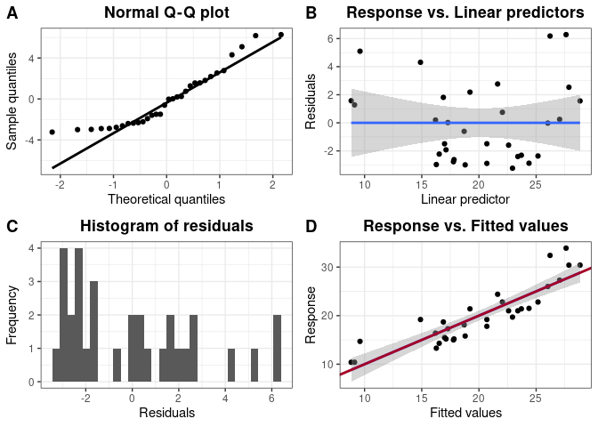

<!-- README.md is generated from README.Rmd. Please edit that file -->

# lmarr

<!-- badges: start -->

[](https://github.com/ranen0827/mypackage.11.15.2022/actions)
<!-- badges: end -->

## Functions

-   `lm_mat()` gives basic information of the variables from the linear
    model, as well as matrix notations useful for further calculation
-   `coef1()` creates coefficient table of the linear model, calculate R
    squared and Adjusted R squared, as well as covariance matrix of the
    model
-   `model_diag()` creates useful diagrams for model diagnostics (using
    residuals,
    fitted values
    
    and original values
    )
-   `eda()` creates useful diagrams for Exploratory Data Analysis (EDA)
    of the variables selected from data frames

## Installation

You can install the development version of package.test.11.15 from
[GitHub](https://github.com/) with:

``` r
# install.packages("devtools")
devtools::install_github("ranen0827/mypackage.11.15.2022")
```

## Usage

This is a basic example which shows you how to solve a common problem:

``` r
library(package.test.11.15)
## basic example code
head(mtcars)
#>                    mpg cyl disp  hp drat    wt  qsec vs am gear carb
#> Mazda RX4         21.0   6  160 110 3.90 2.620 16.46  0  1    4    4
#> Mazda RX4 Wag     21.0   6  160 110 3.90 2.875 17.02  0  1    4    4
#> Datsun 710        22.8   4  108  93 3.85 2.320 18.61  1  1    4    1
#> Hornet 4 Drive    21.4   6  258 110 3.08 3.215 19.44  1  0    3    1
#> Hornet Sportabout 18.7   8  360 175 3.15 3.440 17.02  0  0    3    2
#> Valiant           18.1   6  225 105 2.76 3.460 20.22  1  0    3    1
#                   mpg cyl disp  hp drat    wt  qsec vs am gear carb
# Mazda RX4         21.0   6  160 110 3.90 2.620 16.46  0  1    4    4
# Mazda RX4 Wag     21.0   6  160 110 3.90 2.875 17.02  0  1    4    4
# Datsun 710        22.8   4  108  93 3.85 2.320 18.61  1  1    4    1
# Hornet 4 Drive    21.4   6  258 110 3.08 3.215 19.44  1  0    3    1
# Hornet Sportabout 18.7   8  360 175 3.15 3.440 17.02  0  0    3    2
# Valiant           18.1   6  225 105 2.76 3.460 20.22  1  0    3    1
model <- lm_mat("mpg", c("drat", "disp", "wt"), mtcars, beta0 = TRUE)
names(model)
#>  [1] "xvar"      "yvar"      "Dataset"   "selected"  "beta0"     "N"        
#>  [7] "p"         "X"         "Y"         "H"         "Y_hat"     "residuals"
# [1] "xvar"      "yvar"      "Dataset"   "selected"  "beta0"     "N"         "p"        
# [8] "X"         "Y"         "H"         "Y_hat"     "residuals"

coef1(model)
#> $Coefficients
#>                Estimate   Std.Error    t_value      p_value Sig.
#> (Intercept) 31.04325728 7.099791769  4.3724180 0.0001537253  ***
#> drat         0.84396531 1.455050731  0.5800247 0.5665366794     
#> disp        -0.01638916 0.009578313 -1.7110692 0.0981268355    .
#> wt          -3.17248250 1.217156605 -2.6064703 0.0144951539    *
#> 
#> $F_test
#>    F_value df1 df2      p_value Sig.
#>   33.78303   3  28 1.920364e-09  ***
#> 
#> $Signif.codes
#> [1] "0 ‘***’ 0.001 ‘**’ 0.01 ‘*’ 0.05 ‘.’ 0.1 ‘ ’ 1"
#> 
#> $Adj.R_square
#> [1] 0.7603385
#> 
#> $R_square
#> [1] 0.7835315
#> 
#> $Covariance_matrix
#>             (Intercept)         drat          disp           wt
#> (Intercept) 50.40704316 -9.826936403 -4.214550e-03 -4.295412797
#> drat        -9.82693640  2.117172629  3.350457e-03  0.447391094
#> disp        -0.00421455  0.003350457  9.174408e-05 -0.009014825
#> wt          -4.29541280  0.447391094 -9.014825e-03  1.481470200
# $Coefficients
#                Estimate  Std.Error   t_value      p_value Sig.
# (Intercept) 34.66099474 2.54700388 13.608536 4.019007e-14  ***
# cyl         -1.58727681 0.71184427 -2.229809 3.366495e-02    *
# disp        -0.02058363 0.01025748 -2.006696 5.418572e-02    .

# $F_test
#                F_value df1 df2      p_value Sig.
# F test result 45.80755   2  29 1.057904e-09  ***

# $Signif.codes
# [1] "0 ‘***’ 0.001 ‘**’ 0.01 ‘*’ 0.05 ‘.’ 0.1 ‘ ’ 1"

# $Adj.R_square
# [1] 0.7429841

# $R_square
# [1] 0.7595658

# $Covariance_matrix
#             (Intercept)          cyl          disp
# (Intercept)  6.48722874 -1.615718386  0.0164777387
# cyl         -1.61571839  0.506722267 -0.0065863960
# disp         0.01647774 -0.006586396  0.0001052158
```

``` r
model_diag(model)
#> `geom_smooth()` using formula 'y ~ x'
#> `stat_bin()` using `bins = 30`. Pick better value with `binwidth`.
```



``` r
eda(mtcars[,c(model$yvar, model$xvar)])
```


